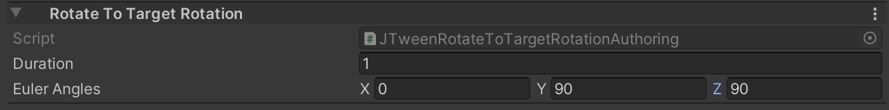
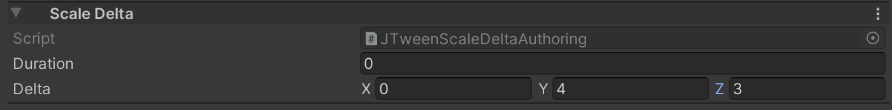
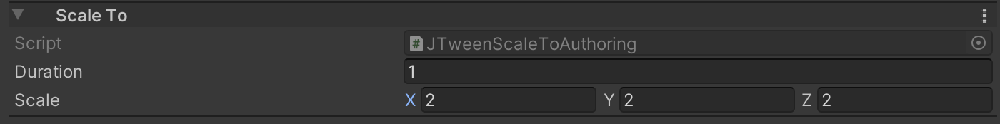
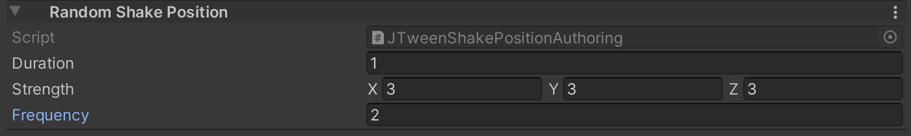
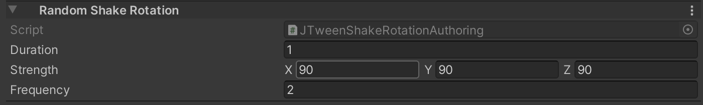
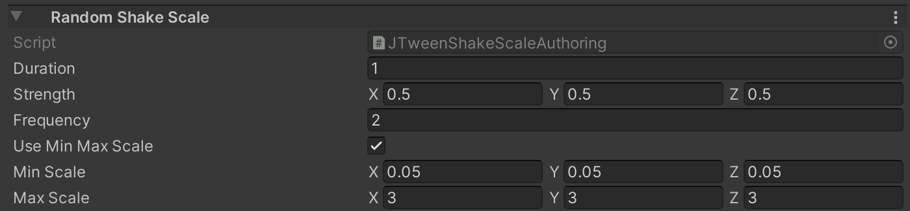
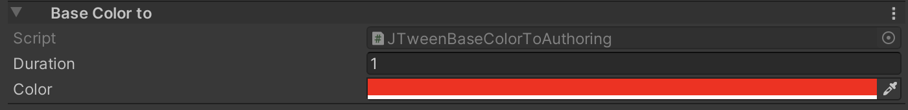
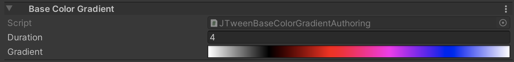

#BuiltIn animations

## Core
JustTweenIt provides two different methods for builtIn animations: for the main thread and scheduled jobs.

Methods for the main thread have optional parameters `GameObjectConversionSystem conversionSystem` and `Component targetComponent`.
This parameters are used during [conversion stage on ECS](https://docs.unity3d.com/Packages/com.unity.entities@0.13/manual/gp_overview.html).

## Move Tweens

### Move
Move - moves **`Translation`** component on **`moveDelta`** in **`durationSeconds`**


Main thread API:
```c#
public static void Move(this JTweenSequence sequence, EntityManager entityManager,
  float3 moveDelta, float durationSeconds,
GameObjectConversionSystem conversionSystem = null, Component targetComponent = null)
```

Jobs API:
```c#
public static void Move(this JTweenSequence sequence, EntityCommandBuffer.Concurrent commandBuffer, int entityInQueryIndex,
 ref DynamicBuffer<JTweenCommandElement> sequenceCommandBuffer,
 float3 moveDelta, float durationSeconds)
```

### MoveTo

MoveTo -  moves **`Translation`** component to **`targetPosition`** in **`durationSeconds`**


Main thread API:
```c#
MoveTo(this JTweenSequence sequence, EntityManager entityManager,  
  float3 targetPosition, float durationSeconds,
  GameObjectConversionSystem conversionSystem = null, Component targetComponent = null)
```

Jobs API:
```c#
public static void MoveTo(this JTweenSequence sequence, EntityCommandBuffer.Concurrent commandBuffer, int entityInQueryIndex,
  ref DynamicBuffer<JTweenCommandElement> sequenceCommandBuffer,
  float3 targetPosition, float durationSeconds)
```

### MoveCurve

MoveCurve - moves **`Translation`** component by **`AnimationCurve`** in **`durationSeconds`**.
You can specify animation curves for each coordinates separately.

MoveCurve has only Main thread API: due too AnimationCurve is a managed class and can't be passed to the job.


Main thread API:
```c#
public static void MoveCurve(this JTweenSequence sequence, EntityManager entityManager,
    AnimationCurve x, AnimationCurve y, AnimationCurve z, float durationSeconds,
    GameObjectConversionSystem conversionSystem = null, Component targetComponent = null)
```

## Rotate Tweens

For rotation tweens you can set rotation angle in two ways: by euler angles in degrees or quaternions.
### Rotate
Rotate - rotates **Rotation** component on **`rotationAngle`** in **`durationSeconds`**
**`rotationAngle`** in degrees.


Main thread API:
```c#
public static void Rotate(this JTweenSequence sequence, EntityManager entityManager, float3 rotationAngle,
    float durationSeconds,
    GameObjectConversionSystem conversionSystem = null, Component targetComponent = null)

public static void Rotate(this JTweenSequence sequence, EntityManager entityManager, quaternion rotationAngle,
            float durationSeconds,
            GameObjectConversionSystem conversionSystem = null, Component targetComponent = null)
```

Jobs API:
```c#
public static void Rotate(this JTweenSequence sequence, EntityCommandBuffer.Concurrent commandBuffer, int entityInQueryIndex,
    ref DynamicBuffer<JTweenCommandElement> sequenceCommandBuffer,
    float3 rotationAngle, float duration)

public static void Rotate(this JTweenSequence sequence, EntityCommandBuffer.Concurrent commandBuffer, int entityInQueryIndex,
           ref DynamicBuffer<JTweenCommandElement> sequenceCommandBuffer,
           quaternion rotationAngle, float duration)
```

### RotateTo
RotateTo - rotates **`Rotation`** component to **`rotationAngle`** in **`durationSeconds`**
**`rotationAngle`** in degrees.



Main thread API:
```c#
public static void RotateTo(this JTweenSequence sequence, EntityManager entityManager,
      float3 targetRotation, float durationSeconds,
      GameObjectConversionSystem conversionSystem = null, Component targetComponent = null)

public static void RotateTo(this JTweenSequence sequence, EntityManager entityManager,
           quaternion targetRotation, float durationSeconds,
           GameObjectConversionSystem conversionSystem = null, Component targetComponent = null)
```

Jobs API:
```c#
public static void RotateTo(this JTweenSequence sequence, EntityCommandBuffer.Concurrent commandBuffer, int entityInQueryIndex,
    ref DynamicBuffer<JTweenCommandElement> sequenceCommandBuffer,
    float3 targetRotation, float durationSeconds)

public static void RotateTo(this JTweenSequence sequence, EntityManager entityManager,
            quaternion targetRotation, float durationSeconds,
            GameObjectConversionSystem conversionSystem = null, Component targetComponent = null)
```

## Scale Tweens

### Scale
Scale - scales **`NonUniformScale`** component by **`scaleDelta`** in **`durationSeconds`**.



Main thread API:
```c#
public static void Scale(this JTweenSequence sequence, EntityManager entityManager, float3 scaleDelta,
       float durationSeconds,
       GameObjectConversionSystem conversionSystem = null, Component targetComponent = null)
```

Jobs API:
```c#
public static void Scale(this JTweenSequence sequence, EntityCommandBuffer.Concurrent commandBuffer, int entityInQueryIndex,
      ref DynamicBuffer<JTweenCommandElement> sequenceCommandBuffer,
      float3 scaleDelta, float durationSeconds)
```

### ScaleTo
ScaleTo - scales **`NonUniformScale`** component to **`targetScale`** in **`durationSeconds`**.



Main thread API:
```c#
public static void ScaleTo(this JTweenSequence sequence, EntityManager entityManager,
       float3 endScale, float durationSeconds,
       GameObjectConversionSystem conversionSystem = null, Component targetComponent = null)
```

Jobs API:
```c#
public static void ScaleTo(this JTweenSequence sequence, EntityCommandBuffer.Concurrent commandBuffer, int entityInQueryIndex,
      ref DynamicBuffer<JTweenCommandElement> sequenceCommandBuffer,
      float3 endScale, float durationSeconds)
```

## Shake Tweens
Shake tweens use [snoise](https://docs.unity3d.com/Packages/com.unity.mathematics@1.1/api/Unity.Mathematics.noise.html?q=snoise#Unity_Mathematics_noise_snoise_Unity_Mathematics_float2_) to implementation of randomization.

### RandomShakePosition
RandomShakePosition - shakes **`Translation`** component in **`durationSeconds`** with **`strength`** and **`frequency`**

- `strength` - The shake max distance relative to start point. You can specify different strength for each axis;
- `frequency` - specify how fast target change position.



Main thread API:
```c#
public static void RandomShakePosition(this JTweenSequence sequence, EntityManager entityManager,
  float3 strength, float frequency, float durationSeconds,
  GameObjectConversionSystem conversionSystem = null, Component targetComponent = null)
```

Jobs API:
```c#
public static void RandomShakePosition(this JTweenSequence sequence, EntityCommandBuffer.Concurrent commandBuffer,
  int entityInQueryIndex, ref DynamicBuffer<JTweenCommandElement> sequenceCommandBuffer,
  float3 strength, float frequency, float durationSeconds)
```

### RandomShakeRotation
RandomShakeRotation - shakes **`Rotation`** component in **`durationSeconds`** with **`strength`** and **`frequency`**

- `strength` - The shake max angle, in degrees, relative to start angle. You can specify different strength for each axis;
- `frequency` - specify how fast target change angle.



Main thread API:
```c#
public static void RandomShakeRotation(this JTweenSequence sequence, EntityManager entityManager,
  float3 strength, float frequency, float durationSeconds,
  GameObjectConversionSystem conversionSystem = null, Component targetComponent = null)
```

Jobs API:
```c#
public static void RandomShakeRotation(this JTweenSequence sequence, EntityCommandBuffer.Concurrent commandBuffer,
  int entityInQueryIndex, ref DynamicBuffer<JTweenCommandElement> sequenceCommandBuffer,
  float3 strength, float frequency, float durationSeconds)
```

### RandomShakeScale
RandomShakeScale - shakes **`NonUniformScale`** component in **`durationSeconds`** with **`strength`** and **`frequency`**

- `strength` - The shake max scale relative to start scale. You can specify different strength for each axis;
- `frequency` - specify how fast target change scale.
- `minScale` - if set, clamps bottom shake scale to this value.
- `maxScale` - if set, clamps upper shake scale to this value.

**`minScale`** and **`maxScale`** can be used to prevent scales to negative values. It is convenient if object default scale is near 1
and scale strength is bigger than 1;



Main thread API:
```c#
public static void RandomShakeScale(this JTweenSequence sequence, EntityManager entityManager, float3 strength, float frequency,
    float durationSeconds, float3? minScale = null, float3? maxScale = null,
    GameObjectConversionSystem conversionSystem = null, Component targetComponent = null)
```

Jobs API:
```c#
public static void RandomShakeScale(this JTweenSequence sequence, EntityCommandBuffer.Concurrent commandBuffer, int entityInQueryIndex,
     ref DynamicBuffer<JTweenCommandElement> sequenceCommandBuffer,
     float3 strength, float frequency,
     float durationSeconds, float3? minScale = null, float3? maxScale = null)
```


## Color Tweens

### BaseColorTo
BaseColorTo - lerp material **`_BaseColor`** property in **`durationSeconds`** to **`targetColor`**



Main thread API:
```c#
public static void BaseColorTo(this JTweenSequence sequence, EntityManager entityManager,
   float4 targetColor, float durationSeconds,
   GameObjectConversionSystem conversionSystem = null, Component targetComponent = null)
```

Jobs API:
```c#
public static void BaseColorTo(this JTweenSequence sequence, EntityCommandBuffer.Concurrent commandBuffer, int entityInQueryIndex,
      ref DynamicBuffer<JTweenCommandElement> sequenceCommandBuffer, float4 targetColor, float durationSeconds)
```

### BaseColorGradient
BaseColorGradient - lerp material **`_BaseColor`** property in **`durationSeconds`** by **`gradient`** value



Main thread API:
```c#
public static void BaseColorGradient(this JTweenSequence sequence, EntityManager entityManager,
    Gradient gradient, float durationSeconds,
    GameObjectConversionSystem conversionSystem = null, Component targetComponent = null)
```

Jobs API:
```c#
public static void BaseColorGradient(this JTweenSequence sequence, EntityCommandBuffer commandBuffer, int entityInQueryIndex,
    ref DynamicBuffer<JTweenCommandElement> sequenceCommandBuffer,
    Gradient gradient, float durationSeconds)
```
