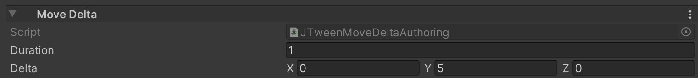
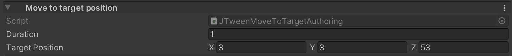
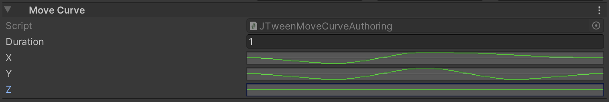
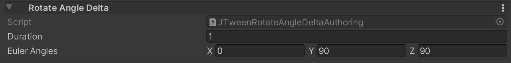

#BuiltIn animations

## Core
JustTweenIt provides two different methods for builtIn animations: for the main thread and scheduled jobs.

Methods for the main thread have optional parameters `GameObjectConversionSystem conversionSystem` and `Component targetComponent`.
This parameters are used during [conversion stage on ECS](https://docs.unity3d.com/Packages/com.unity.entities@0.13/manual/gp_overview.html).

## Move Tweens

### Move
Move - moves **Translation** component on **moveDelta** in **durationSeconds**



Main thread API:
```c#
public static void Move(this JTweenSequence sequence, EntityManager entityManager,
  float3 moveDelta, float durationSeconds,
GameObjectConversionSystem conversionSystem = null, Component targetComponent = null)
```

Jobs API:
```c#
public static void Move(this JTweenSequence sequence, EntityCommandBuffer.Concurrent commandBuffer, int entityInQueryIndex,
 ref DynamicBuffer<JTweenCommandElement> sequenceCommandBuffer,
 float3 moveDelta, float durationSeconds)
```

### MoveTo

MoveTo -  moves **Translation** component to **endPosition** in **durationSeconds**


Main thread API:
```c#
MoveTo(this JTweenSequence sequence, EntityManager entityManager,  
  float3 endPosition, float durationSeconds,
  GameObjectConversionSystem conversionSystem = null, Component targetComponent = null)
```

Jobs API:
```c#
public static void MoveTo(this JTweenSequence sequence, EntityCommandBuffer.Concurrent commandBuffer, int entityInQueryIndex,
  ref DynamicBuffer<JTweenCommandElement> sequenceCommandBuffer,
  float3 endPosition, float durationSeconds)
```

### MoveCurve

MoveCurve - move **Translation** component by **AnimationCurve** in **durationSeconds**.
You can specify animation curves for each coordinates separately


Main thread API:
```c#
public static void MoveCurve(this JTweenSequence sequence, EntityManager entityManager,
    AnimationCurve x, AnimationCurve y, AnimationCurve z, float durationSeconds,
    GameObjectConversionSystem conversionSystem = null, Component targetComponent = null)
```

Jobs API:
```c#
public static void MoveCurve(this JTweenSequence sequence, EntityCommandBuffer commandBuffer,
    ref DynamicBuffer<JTweenCommandElement> sequenceCommandBuffer,
    AnimationCurve x, AnimationCurve y, AnimationCurve z, float durationSeconds)
```

## Rotate Tweens

### Rotate
Rotate - rotates **Rotation** component by **rotationAngle** in **durationSeconds**
**rotationAngle** in degrees.


Main thread API:
```c#
public static void Rotate(this JTweenSequence sequence, EntityManager entityManager, float3 rotationAngle,
    float duration,
    GameObjectConversionSystem conversionSystem = null, Component targetComponent = null)
```

Jobs API:
```c#
public static void Rotate(this JTweenSequence sequence, EntityCommandBuffer.Concurrent commandBuffer, int entityInQueryIndex,
    ref DynamicBuffer<JTweenCommandElement> sequenceCommandBuffer,
    float3 rotationAngle, float duration)
```

## Scale Tweens

## Shake Tweens

## Color Tweens
