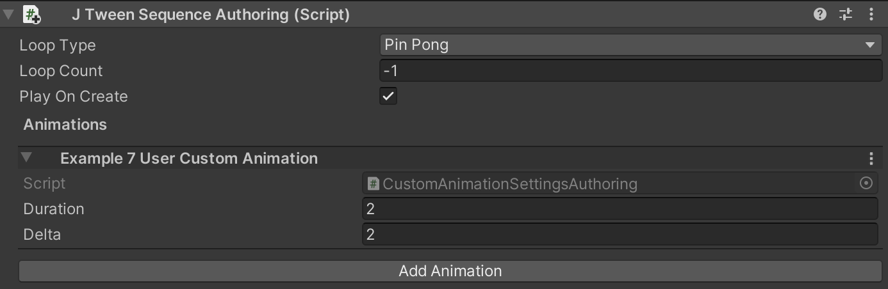

# Create user custom animation

JustTweenIt design to support user custom animation written on pure ECS stile.
It provides code structure to integrate user systems into JustTweenIt sequence systems.

You can find all example code in the "Example 7 - User custom animation" scene provided by JustTweenIt plugin.


To create custom animation you should add several classes to your project.

First is the actual data component which will be animated by JustTweenIt:
It can be any types natively supported by Unity ECS.

```c#
[GenerateAuthoringComponent]
public struct CustomAnimatedData : IComponentData
{
  public float AnimatedFloat;
}
```

Also you should add your custom animation component. It can store animation settings if needed:

```c#
public struct CustomAnimationSettings : IComponentData
{
  public float Delta;
  public float StartValue;
  public float EndValue;
}
```

For configuring animation from the editor inspector you may want to add Authoring component
to you AnimationSettings component:

```c#
public class CustomAnimationSettingsAuthoring : JTweenAnimationAuthoring
{
  public override string AnimationName => "Example 7 User Custom Animation";

  public float delta;

  public override void ConvertToEntity(EntityManager dstManager, JTweenSequence sequence, GameObjectConversionSystem conversionSystem,
    Component targetComponent)
  {
    sequence.AddUserCustomAnimation(dstManager, delta, duration, conversionSystem, targetComponent);
  }
}
```

By adding this class you adds inspector data to JustTweenSequenceAuthoring.  If you don't need to animate your data from the inspector
you can skip this class




To create animation, you should write several methods:

Method, which is creates animation in the main thread, it also uses during conversion stage by CustomAnimationSettingsAuthoring class.

```
public static void AddUserCustomAnimation(this JTweenSequence sequence, EntityManager entityManager,
	float delta, float durationSeconds,
	GameObjectConversionSystem conversionSystem = null, Component targetComponent = null)
{
	var sequenceElementEntity = JTweenHelper.CreateEntity(entityManager, conversionSystem, targetComponent);
	JTweenHelper.AddCommonAnimationComponents(sequence, entityManager, durationSeconds, sequenceElementEntity,
		UserCustomAnimationType);
	entityManager.AddComponent<JTweenMoveTo>(sequenceElementEntity);

	CustomAnimationSettings tweenMoveDelta = new CustomAnimationSettings
	{
		Delta = delta
	};
	entityManager.AddComponentData(sequenceElementEntity, tweenMoveDelta);
}
```

This method adds CustomAnimationSettings to the target sequence.  


For running animation from the jobs you should add two additional methods and one component:

CreateCommand component stores all the data needed to the animation. All commands executes during **JTweenPlaySequenceCommandsSystem** on the main thread

```c#
public struct CreateCommand : IComponentData
{
	public JTweenSequence JTweenSequence;
	public float Duration;
	public CustomAnimationSettings CustomAnimationSettings;
}
```

This method adds CreateCommand to the sequence during the job
```c#
public static void AddUserCustomAnimation(this JTweenSequence sequence,
	EntityCommandBuffer.ParallelWriter commandBuffer, int entityInQueryIndex,
	ref DynamicBuffer<JTweenCommandElement> sequenceCommandBuffer,
	float delta, float durationSeconds)
{
	CustomAnimationSettings customAnimationSettings = new CustomAnimationSettings
	{
		Delta = delta
	};

	// in the job, don't create animation itself, but create command, which will be executed later
	// in the JTweenPlaySequenceCommandsSystem  
	CustomAnimationSettings.CreateCommand createCommand = new CustomAnimationSettings.CreateCommand
	{
		CustomAnimationSettings = customAnimationSettings,
		Duration = durationSeconds,
		JTweenSequence = sequence
	};

	var e = commandBuffer.CreateEntity(entityInQueryIndex);

	JTweenCommandElement commandElement = new JTweenCommandElement
	{
		CommandEntity = e,
		CommandType = UserCustomAnimationType
	};
	sequenceCommandBuffer.Add(commandElement);

	commandBuffer.AddComponent<JTweenMoveDelta.CreateCommand>(entityInQueryIndex, e);
	commandBuffer.SetComponent(entityInQueryIndex, e, createCommand);

	if (sequenceCommandBuffer.Length == 1)
	{
		commandBuffer.AddComponent<JTweenNeedPlayCreateCommand>(entityInQueryIndex, sequence.SequenceEntity);
	}
}
```

This method runs by ***JTweenPlaySequenceCommandsSystem*** on the main thread during executing CreateCommand
```c#
internal static void ExecuteUserCustomAnimationCommand(EntityManager entityManager,
	JTweenCommandElement command)
{
	var createCommand =
		entityManager.GetComponentData<CustomAnimationSettings.CreateCommand>(command.CommandEntity);
	var data = createCommand.CustomAnimationSettings;
	createCommand.JTweenSequence.AddUserCustomAnimation(entityManager, data.Delta, createCommand.Duration);
}
```
